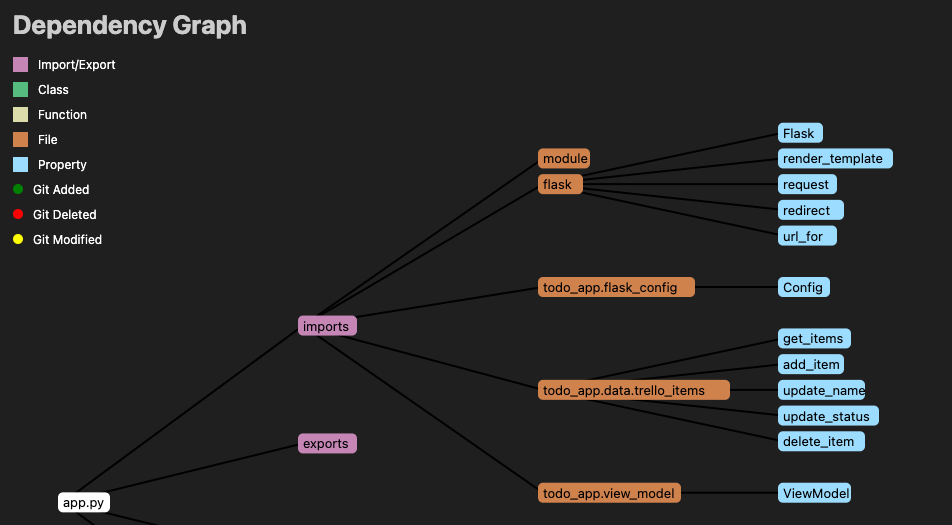

# DevOps Apprenticeship: Project Exercise

> If you are using GitPod for the project exercise (i.e. you cannot use your local machine) then you'll want to launch a VM using the [following link](https://gitpod.io/#https://github.com/CorndelWithSoftwire/DevOps-Course-Starter). Note this VM comes pre-setup with Python & Poetry pre-installed.

## System Requirements

The project uses poetry for Python to create an isolated environment and manage package dependencies. To prepare your system, ensure you have an official distribution of Python version 3.8+ and install Poetry using one of the following commands (as instructed by the [poetry documentation](https://python-poetry.org/docs/#system-requirements)):

### Poetry installation (Bash)

```bash
curl -sSL https://install.python-poetry.org | python3 -
```

### Poetry installation (PowerShell)

```powershell
(Invoke-WebRequest -Uri https://install.python-poetry.org -UseBasicParsing).Content | py -
```

You can check poetry is installed by running `poetry --version` from a terminal.

**Please note that after installing poetry you may need to restart VSCode and any terminals you are running before poetry will be recognised.**

## Dependencies

The project uses a virtual environment to isolate package dependencies. To create the virtual environment and install required packages, run the following from your preferred shell:

```bash
$ poetry install
```

You'll also need to clone a new `.env` file from the `.env.template` to store local configuration options. This is a one-time operation on first setup:

```bash
$ cp .env.template .env  # (first time only)
```

The `.env` file is used by flask to set environment variables when running `flask run`. This enables things like development mode (which also enables features like hot reloading when you make a file change). There's also a [SECRET_KEY](https://flask.palletsprojects.com/en/2.3.x/config/#SECRET_KEY) variable which is used to encrypt the flask session cookie.

## Environment variables

Save your MongoDB connection string and database name in .env

## Running the App

Once the all dependencies have been installed, start the Flask app in development mode within the Poetry environment by running:
```bash
$ poetry run flask run
```

You should see output similar to the following:
```bash
 * Serving Flask app 'todo_app/app'
 * Debug mode: on
WARNING: This is a development server. Do not use it in a production deployment. Use a production WSGI server instead.
 * Running on http://127.0.0.1:5000
Press CTRL+C to quit
 * Restarting with stat
 * Debugger is active!
 * Debugger PIN: 113-666-066
```
Now visit [`http://localhost:5000/`](http://localhost:5000/) in your web browser to view the app.

## Local testing
To run the tests, run the following in a terminal:
```bash
$ poetry run pytest
```

To run an individual test file/test, specify its path as a pytest argument, e.g.:
```bash
$ poetry run pytest todo_app/tests/TEST_FILE_NAME.py::TEST_FUNCTION_NAME
```
Integration and unit tests are in todo_app/tests, end-to-end tests are in todo_app/tests_e2e

## Ansible
To provision a VM, first ensure .env.j2, ansible-inventory.ini, ansible-playbook.yaml and todoapp.service are all on the control node. Populate .env.j2 with your environment variables on the control node and encrypt the file with 
```bash
$ ansible-vault encrypt .env.j2
```
Save the password this requires you to create somewhere secure for later use.

Then run the following command from the control node, entering your password when prompted:
```bash
$ ansible-playbook ansible-playbook.yaml --ask-vault-pass -i ansible-inventory.ini
```

## Docker
Setup (with docker compose - recommended):
To build, (re)create, start, and attach dev (port 5000), prod (port 80) and (watch mode) test envs just run:
```bash
docker compose up
```

Setup (manual)
To build a docker image, run 
```bash
docker build --target production --tag todo-app:prod .
```

dev:
```bash
docker build --target development --tag todo-app:dev .
```

To make a new container running the app (locally on port 5000 for dev, 80 for prod), then run
prod:
```bash
docker run --env-file .env -p 80:80 todo-app:prod
```

dev (with hot reloading):
```bash
docker run --env-file .env -p 5000:5000  --mount type=bind,source="$(pwd)"/todo_app,target=/todo_app todo-app:dev
```

Debug mode:
Run
```bash
docker compose --file docker-compose-debug.yml up
```
Then use the Remote Development extension to open the debug container, and debug as normal (running the Python: Flask debug config at present, doesn't use poetry installation so you'll need to install flask and requests in the container).

Running specific test suites in Docker (included in docker compose up but here are the individual steps):

Build test image:
```bash
docker build --platform linux/amd64 --target test --tag todo_app:test .
```

Run unit tests:
```bash
docker run --platform linux/amd64 --mount type=bind,source="$(pwd)"/todo_app,target=/todo_app todo_app:test todo_app/tests
```

Run end to end tests:
```bash
docker run --platform linux/amd64 --mount type=bind,source="$(pwd)"/todo_app,target=/todo_app --env-file .env todo_app:test todo_app/tests_e2e
```

## Architecture Diagrams

The project uses Structurizr Lite to make architecture diagrams, start it with the following commands, replacing PATH with the path to the structurizr data directory in this project:

```bash
docker pull structurizr/lite
docker run -it --rm -p 8080:8080 -v PATH:/usr/local/structurizr structurizr/lite
```

The diagram defined by workspace.dsl will then be rendered at http://localhost:8080

Each separate view in workspace.dsl is automatically saved as a thumbnail image in structurizr/.structurizr/images/

To view a code diagram for a given file, install the Dependency Graph Viewer VSCode extension then right click on the file and select "View Dependency Graph. Here's a snippet of what it should look like:


## Put production container image on Docker Hub

Steps: 
    - Log into DockerHub locally, with
```bash
docker login
```
    - Build the image, with 
```bash
docker build --target production --platform=linux/amd64 --tag <user_name>/todo-app:prod .
```
    - Push the image, with
```bash
docker push <user_name>/todo-app:prod
```
## Updating the container:

Find the webhook URL (under Deployment Center on the app service’s page in the Azure portal).

In a Linux/Mac shell (or Git Bash on Windows), run
```bash
curl -v -X POST '<webhook>'
```

## Web addresses:
Example docker image: hub.docker.com/r/natdeanlewissoftwire/todo-app/tags
Live site: wicrosofttodo.azurewebsites.net